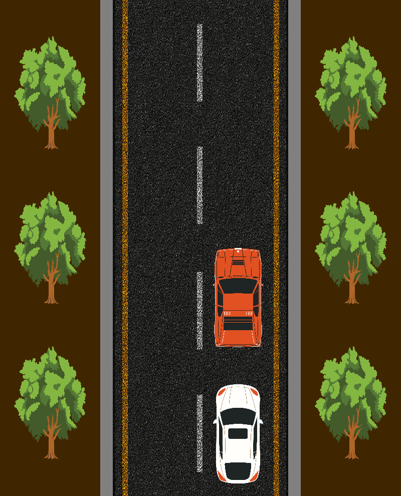

# Car Passing Simulator

Mincu Adrian-Lucian 332

## Task

**OVERTAKE**: Simulate an "overtaking" scenario: a car / a rectangle moves uniformly (through translation),
another rectangle comes from behind (also through translations/rotations), at some point it begins to overtake,
then moves in front of the first one.

## Project Concept

### Description

This project simulates a vehicle overtaking scenario: the right car moves at a steady pace, while the player 
controls the left car with the goal of overtaking to win the game. If the player's car veers off the road or 
fails to complete the overtake within the time limit, it results in a loss; a successful overtake secures a win.

### Controls

- Use `W`, `A`, `S`, `D` or `↑`, `←`, `↓`, `→` to steer the car.
- Press `R` to reset the game or `ESC` to exit.

## Applied Transformations

### Resize Transform

A resizing transformation is applied to expand the coordinate system, allowing for greater precision and detail. 
The coordinates are then scaled back to fit within the normalized range of `[-1, 1]` for display.

### Translate Transform

Translation is used to animate the cars' movement and enable user-controlled positioning.

## Originality of the Approach

### Level-Based Challenge

The game is designed as a single-level challenge where the objective is to successfully overtake the car in front. 
This setup adds a sense of progression and achievement upon completing the maneuver.

### Interactive User-Controlled Vehicle

The player controls the car directly, offering a more immersive and engaging experience that emphasizes skill and timing.

### Enhanced Visuals

Custom textures and improved graphics enhance the overall gameplay, providing a visually appealing and enjoyable environment.

## Code Implementation

### [Car Movement](https://www.youtube.com/watch?v=0ziW8Gbi59M&list=PLB5_pVetb2rIQ9pRyCA_RyQuO8RT8FWdH)

```C++
void UpdateCarPosition() {
	moveX += (keyRightPressed - keyLeftPressed) * movementStep;
	moveY += (keyUpPressed - keyDownPressed) * movementStep;
}

void MoveForward() {
	if (hasStarted)
		i += forwardStep;
}

struct Point {
	float x = 0.0f;
	float y = 0.0f;
};

struct CarCoordinates
{
	Point bottomLeft, topRight;
};

std::pair<CarCoordinates, CarCoordinates> getCarsCoordinates() {
	CarCoordinates dynamicCar = {
		{ moveX + 75 - carSizeX / 2, moveY - carSizeY / 2 - 375 },
		{ moveX + 75 + carSizeX / 2, moveY + carSizeY / 2 - 375 }
	};

	CarCoordinates staticCar = {
		{ 25, i - carSizeY / 2 - 100 },
		{ 175, i + carSizeY / 2 - 100 } 
	};

	return { dynamicCar, staticCar };
}
```

### [Collision and Win Condition](https://www.youtube.com/watch?v=u1W8Gd-bDv4&list=PLB5_pVetb2rIQ9pRyCA_RyQuO8RT8FWdH&index=2) 

```C++
void CheckCollisions() {
	std::pair<CarCoordinates, CarCoordinates> coordinates = getCarsCoordinates();
	CarCoordinates dynamicCarCoordinates = coordinates.first;
	CarCoordinates staticCarCoordinates = coordinates.second;
	

	// check for curb collisions and lower/upper bound limit
	if (
		dynamicCarCoordinates.bottomLeft.x <= -175
		|| dynamicCarCoordinates.topRight.x >= 175
		|| dynamicCarCoordinates.bottomLeft.y <= -500
		|| dynamicCarCoordinates.topRight.y >= 500
	)
		gameState = -1;

	// check for car collisions
		// checks if top right corner is inside the other car
	if (dynamicCarCoordinates.topRight.x >= staticCarCoordinates.bottomLeft.x + tolerance && dynamicCarCoordinates.topRight.x <= staticCarCoordinates.topRight.x - tolerance
		&& dynamicCarCoordinates.topRight.y >= staticCarCoordinates.bottomLeft.y + tolerance && dynamicCarCoordinates.topRight.y <= staticCarCoordinates.topRight.y - tolerance) {
		gameState = -1;
	}

		// checks if bottom right corner is inside the other car
	if (dynamicCarCoordinates.topRight.x >= staticCarCoordinates.bottomLeft.x + tolerance && dynamicCarCoordinates.topRight.x <= staticCarCoordinates.topRight.x - tolerance
		&& dynamicCarCoordinates.bottomLeft.y >= staticCarCoordinates.bottomLeft.y + tolerance && dynamicCarCoordinates.bottomLeft.y <= staticCarCoordinates.topRight.y - tolerance) {
		gameState = -1;
	}
}

void CheckWinCondition() {
	std::pair<CarCoordinates, CarCoordinates> coordinates = getCarsCoordinates();
	CarCoordinates dynamicCarCoordinates = coordinates.first;
	CarCoordinates staticCarCoordinates = coordinates.second;

	if (dynamicCarCoordinates.bottomLeft.x >= 20 && dynamicCarCoordinates.bottomLeft.y >= staticCarCoordinates.topRight.y)
		gameState = 1;
}
```

### [Gamestate Logic](https://www.youtube.com/watch?v=msTzXSbyCkg&list=PLB5_pVetb2rIQ9pRyCA_RyQuO8RT8FWdH&index=3)

```C++
void RenderFunction(void)
{
	glClear(GL_COLOR_BUFFER_BIT);

	CheckCollisions();
	CheckWinCondition();

	switch (gameState) {
		case -1:
			myMatrix = resizeMatrix;
			glUniformMatrix4fv(myMatrixLocation, 1, GL_FALSE, &myMatrix[0][0]);

			glActiveTexture(GL_TEXTURE0);
			glBindTexture(GL_TEXTURE_2D, texture_lost);

			glUniform1i(glGetUniformLocation(ProgramId, "myTexture"), 0);
			glUniform1i(glGetUniformLocation(ProgramId, "hasTexture"), 1);

			glDrawElements(GL_POLYGON, 4, GL_UNSIGNED_INT, (void*)(sizeof(GLuint) * 16));

			glBindTexture(GL_TEXTURE_2D, 0);
			glUniform1i(glGetUniformLocation(ProgramId, "hasTexture"), 0);

			break;
		case  1:
			myMatrix = resizeMatrix;
			glUniformMatrix4fv(myMatrixLocation, 1, GL_FALSE, &myMatrix[0][0]);

			glActiveTexture(GL_TEXTURE0);
			glBindTexture(GL_TEXTURE_2D, texture_won);

			glUniform1i(glGetUniformLocation(ProgramId, "myTexture"), 0);
			glUniform1i(glGetUniformLocation(ProgramId, "hasTexture"), 1);

			glDrawElements(GL_POLYGON, 4, GL_UNSIGNED_INT, (void*)(sizeof(GLuint) * 16));

			glBindTexture(GL_TEXTURE_2D, 0);
			glUniform1i(glGetUniformLocation(ProgramId, "hasTexture"), 0);

			break;
		case  0:
			MoveForward();
    }
}
```

### Reusability of Objects

Each object was only drawn once and reused, the location of it was changed
with translations.

The following code block shows all object vertices loaded into the scene:

```C++
GLfloat Vertices[] = {
	// car vertices - left
	-50.0f,   100.0f, 0.0f, 1.0f,    0.0f, 0.0f, 0.0f,   0.0f, 1.0f,
	-50.0f,  -100.0f, 0.0f, 1.0f,    0.0f, 0.0f, 0.0f,   0.0f, 0.0f,
	 50.0f,  -100.0f, 0.0f, 1.0f,    0.0f, 0.0f, 0.0f,   1.0f, 0.0f,
	 50.0f,   100.0f, 0.0f, 1.0f,    0.0f, 0.0f, 0.0f,   1.0f, 1.0f,

	// road vertices
	-175.0f,   500.0f, 0.0f, 1.0f,    0.0f, 0.0f, 0.0f,   0.0f, 1.0f,
	-175.0f,  -500.0f, 0.0f, 1.0f,    0.0f, 0.0f, 0.0f,   0.0f, 0.0f,
	 175.0f,  -500.0f, 0.0f, 1.0f,    0.0f, 0.0f, 0.0f,   1.0f, 0.0f,
	 175.0f,   500.0f, 0.0f, 1.0f,    0.0f, 0.0f, 0.0f,   1.0f, 1.0f,

	// curbs vertices - left
	-200.0f,   500.0f, 0.0f, 1.0f,    0.5f, 0.5f, 0.5f,   0.0f, 1.0f,
	-200.0f,  -500.0f, 0.0f, 1.0f,    0.5f, 0.5f, 0.5f,   0.0f, 0.0f,
	-175.0f,  -500.0f, 0.0f, 1.0f,    0.5f, 0.5f, 0.5f,   1.0f, 0.0f,
	-175.0f,   500.0f, 0.0f, 1.0f,    0.5f, 0.5f, 0.5f,   1.0f, 1.0f,

	// tree - bottom left
	-375.0f,  -250.0f, 0.0f, 1.0f,    0.0f, 1.0f, 0.0f,   0.0f, 1.0f,
	-375.0f,  -500.0f, 0.0f, 1.0f,    0.0f, 1.0f, 0.0f,   0.0f, 0.0f,
	-225.0f,  -500.0f, 0.0f, 1.0f,    0.0f, 1.0f, 0.0f,   1.0f, 0.0f,
	-225.0f,  -250.0f, 0.0f, 1.0f,    0.0f, 1.0f, 0.0f,   1.0f, 1.0f,

	// end screen
	-400.0f,   500.0f, 0.0f, 1.0f,    1.0f, 0.0f, 0.0f,   0.0f, 1.0f,
	-400.0f,  -500.0f, 0.0f, 1.0f,    1.0f, 0.0f, 0.0f,   0.0f, 0.0f,
	 400.0f,  -500.0f, 0.0f, 1.0f,    1.0f, 0.0f, 0.0f,   1.0f, 0.0f,
	 400.0f,   500.0f, 0.0f, 1.0f,    1.0f, 0.0f, 0.0f,   1.0f, 1.0f,
};

GLuint Indices[] = {
	 // car_01 indices
	 0,  1,  2,  3,
	 // car_02 indices
	 4,  5,  6,  7,
	 
	 // curb indices
	 8,  9, 10, 11,

	 // tree indices
	12, 13, 14, 15,

	 // end screen
	16, 17, 18, 19,
};
```

**Tree Duplication Using Translations:**

The trees are rendered by drawing one tree model and applying transformations to duplicate it across the scene. 

```C++
// trees
float treeGap = 62.5;
float treeRightTranslation = 600;

glActiveTexture(GL_TEXTURE0);
glBindTexture(GL_TEXTURE_2D, texture_tree);

glUniform1i(glGetUniformLocation(ProgramId, "myTexture"), 0);
glUniform1i(glGetUniformLocation(ProgramId, "hasTexture"), 1);

// left from bottom to top 
myMatrix = resizeMatrix * glm::translate(glm::mat4(1.0f), glm::vec3(0, treeGap, 0));
glUniformMatrix4fv(myMatrixLocation, 1, GL_FALSE, &myMatrix[0][0]);

glDrawElements(GL_POLYGON, 4, GL_UNSIGNED_INT, (void*)(sizeof(GLuint) * 12));

myMatrix = resizeMatrix * glm::translate(glm::mat4(1.0f), glm::vec3(0, 250 + 2 * treeGap, 0));
glUniformMatrix4fv(myMatrixLocation, 1, GL_FALSE, &myMatrix[0][0]);

glDrawElements(GL_POLYGON, 4, GL_UNSIGNED_INT, (void*)(sizeof(GLuint) * 12));

myMatrix = resizeMatrix * glm::translate(glm::mat4(1.0f), glm::vec3(0, 500 + 3 * treeGap, 0));
glUniformMatrix4fv(myMatrixLocation, 1, GL_FALSE, &myMatrix[0][0]);

glDrawElements(GL_POLYGON, 4, GL_UNSIGNED_INT, (void*)(sizeof(GLuint) * 12));

// right from bottom to top
myMatrix = resizeMatrix * glm::translate(glm::mat4(1.0f), glm::vec3(treeRightTranslation, treeGap, 0));
glUniformMatrix4fv(myMatrixLocation, 1, GL_FALSE, &myMatrix[0][0]);

glDrawElements(GL_POLYGON, 4, GL_UNSIGNED_INT, (void*)(sizeof(GLuint) * 12));

myMatrix = resizeMatrix * glm::translate(glm::mat4(1.0f), glm::vec3(treeRightTranslation, 250 + 2 * treeGap, 0));
glUniformMatrix4fv(myMatrixLocation, 1, GL_FALSE, &myMatrix[0][0]);

glDrawElements(GL_POLYGON, 4, GL_UNSIGNED_INT, (void*)(sizeof(GLuint) * 12));

myMatrix = resizeMatrix * glm::translate(glm::mat4(1.0f), glm::vec3(treeRightTranslation, 500 + 3 * treeGap, 0));
glUniformMatrix4fv(myMatrixLocation, 1, GL_FALSE, &myMatrix[0][0]);

glDrawElements(GL_POLYGON, 4, GL_UNSIGNED_INT, (void*)(sizeof(GLuint) * 12));

glBindTexture(GL_TEXTURE_2D, 0);
glUniform1i(glGetUniformLocation(ProgramId, "hasTexture"), 0);
```

Car Duplication with Modified Logic

For cars, I slightly modified the logic to account for different transformations. The example below shows how 
I reuse a single car model but vary its placement and orientation across the scene.

```C++
// cars
	// left
UpdateCarPosition();

controlCarMatrix = glm::translate(glm::mat4(1.0f), glm::vec3(moveX, moveY, 0));
myMatrix = resizeMatrix * controlCarMatrix * glm::translate(glm::mat4(1.0f), glm::vec3(75, -375, 0));
glUniformMatrix4fv(myMatrixLocation, 1, GL_FALSE, &myMatrix[0][0]);

glActiveTexture(GL_TEXTURE0);
glBindTexture(GL_TEXTURE_2D, texture_car_01);

glUniform1i(glGetUniformLocation(ProgramId, "myTexture"), 0);
glUniform1i(glGetUniformLocation(ProgramId, "hasTexture"), 1);

glDrawElements(GL_POLYGON, 4, GL_UNSIGNED_INT, (void*)(0));

glBindTexture(GL_TEXTURE_2D, 0);
glUniform1i(glGetUniformLocation(ProgramId, "hasTexture"), 0);

	// right
controlCarMatrix = glm::translate(glm::mat4(1.0f), glm::vec3(0, i, 0));
myMatrix = resizeMatrix * controlCarMatrix * glm::translate(glm::mat4(1.0f), glm::vec3(75, -100, 0.0));
glUniformMatrix4fv(myMatrixLocation, 1, GL_FALSE, &myMatrix[0][0]);

glActiveTexture(GL_TEXTURE0);
glBindTexture(GL_TEXTURE_2D, texture_car_02);

glUniform1i(glGetUniformLocation(ProgramId, "myTexture"), 0);
glUniform1i(glGetUniformLocation(ProgramId, "hasTexture"), 1);

glDrawElements(GL_POLYGON, 4, GL_UNSIGNED_INT, (void*)(0));

glBindTexture(GL_TEXTURE_2D, 0);
glUniform1i(glGetUniformLocation(ProgramId, "hasTexture"), 0);
```

The scene below demonstrates the result:


