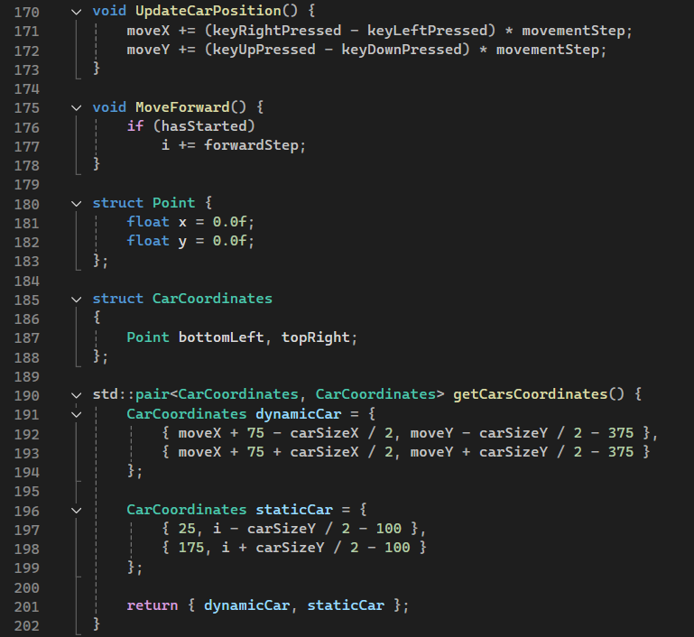
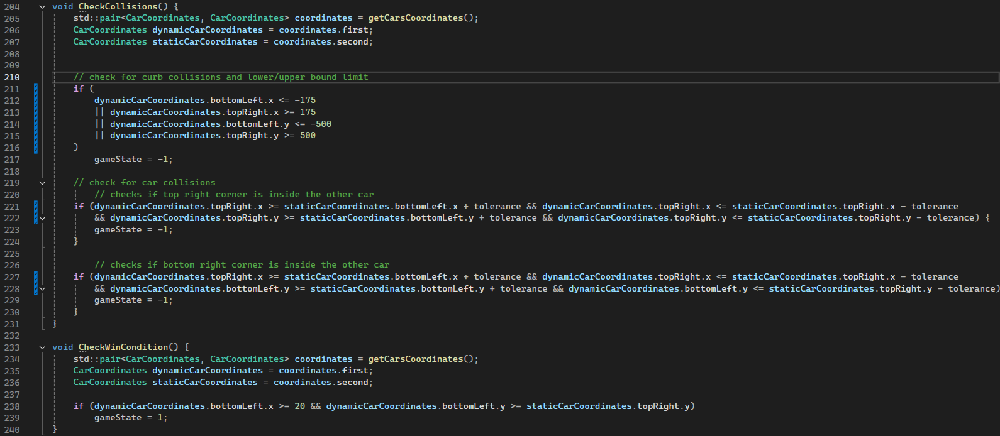
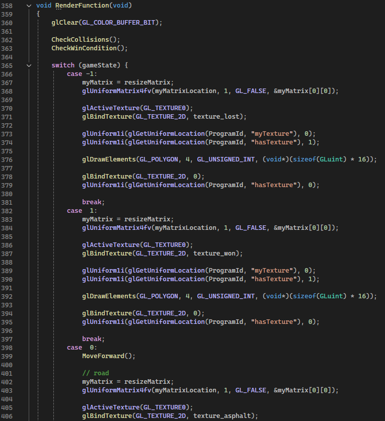
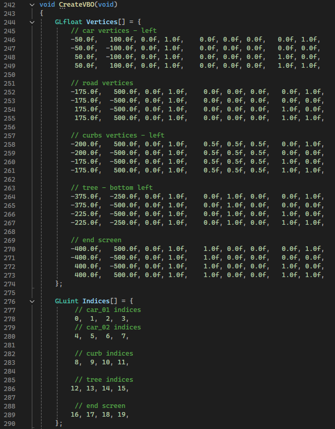
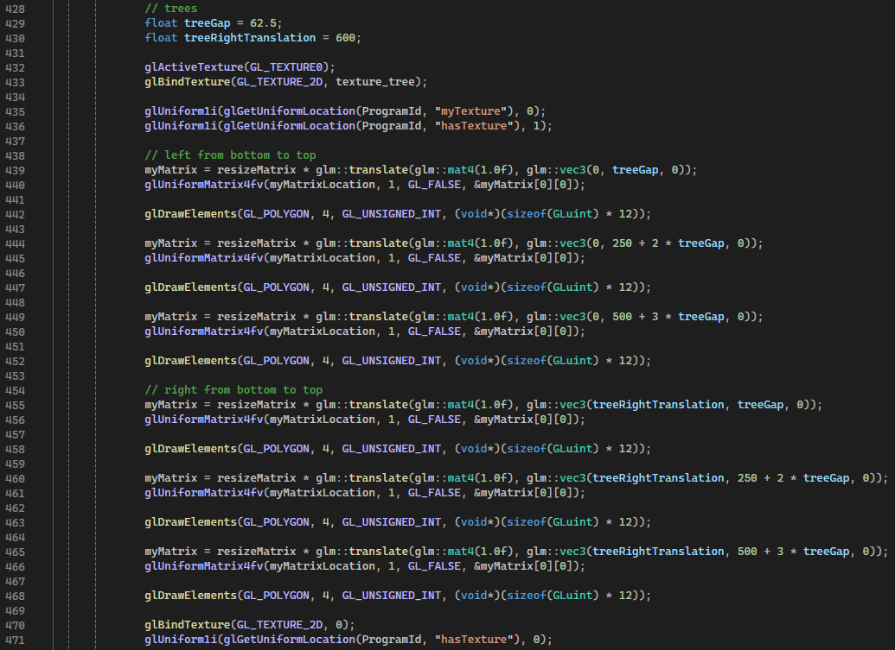
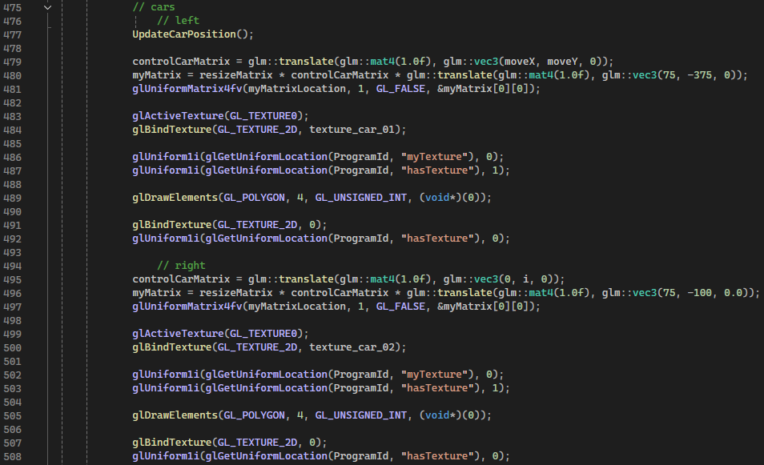

# Car Passing Simulator

Mincu Adrian-Lucian 332

## Task

**OVERTAKE**: Simulate an "overtaking" scenario: a car / a rectangle moves uniformly (through translation),
another rectangle comes from behind (also through translations/rotations), at some point it begins to overtake,
then moves in front of the first one.

## Project Concept

### Description

This project simulates a vehicle overtaking scenario: the right car moves at a steady pace, while the player 
controls the left car with the goal of overtaking to win the game. If the player's car veers off the road or 
fails to complete the overtake within the time limit, it results in a loss; a successful overtake secures a win.

### Controls

- Use `W`, `A`, `S`, `D` or `↑`, `←`, `↓`, `→` to steer the car.
- Press `R` to reset the game or `ESC` to exit.

## Applied Transformations

### Resize Transform

A resizing transformation is applied to expand the coordinate system, allowing for greater precision and detail. 
The coordinates are then scaled back to fit within the normalized range of `[-1, 1]` for display.

### Translate Transform

Translation is used to animate the cars' movement and enable user-controlled positioning.

## Originality of the Approach

### Level-Based Challenge

The game is designed as a single-level challenge where the objective is to successfully overtake the car in front. 
This setup adds a sense of progression and achievement upon completing the maneuver.

### Interactive User-Controlled Vehicle

The player controls the car directly, offering a more immersive and engaging experience that emphasizes skill and timing.

### Enhanced Visuals

Custom textures and improved graphics enhance the overall gameplay, providing a visually appealing and enjoyable environment.

## Code Implementation

### Car Movement

### Collision and Win Condition

### Gamestate Logic

### Reusability of Objects

